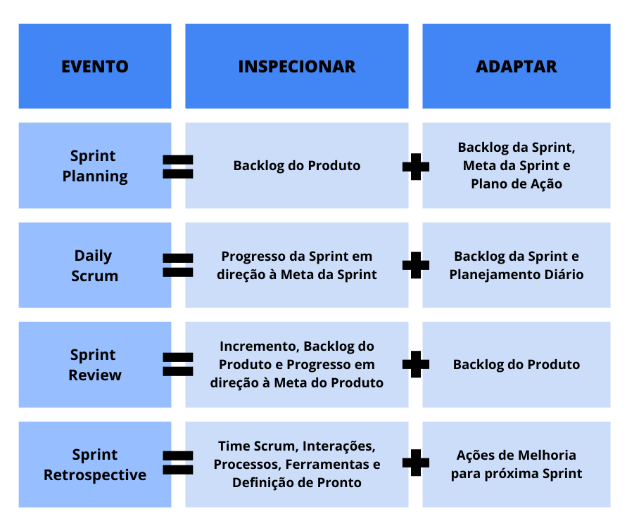

# 🚀 SCRUM

---
## 📖 Definição
Framework ágil que define papéis e eventos específicos para a gestão do trabalho em equipe, estruturado em iterações curtas (sprints) com objetivos definidos, buscando entregas incrementais de valor e a adaptação contínua ao contexto, com foco na gestão do projeto como um todo. 

## ☰ Características
1. Baseado em **Empirismo**, **Lean** e **Agile**
2. **Iterativo e Incremental (I & I)**
3. Executado em **Ciclos (Sprints)**

---

## ☢ Quando usar?
Indicado para **pequenos times auto-organizáveis**:
- Até **10 pessoas**

---
## 🛕 Pilares

| # | Pilar            | Descrição |
|---|------------------|-----------|
| 1 | **Transparência** | Toda informação relevante deve ser visível para todos os envolvidos |
| 2 | **Inspeção**      | Avaliar regularmente o progresso e o trabalho realizado |
| 3 | **Adaptação**     | Ajustar planos rapidamente diante de descobertas ou mudanças |

---

## 📦 Artefatos
1. **Product Backlog (PB)**
2. **Sprint Backlog (SB)**
    > Lista priorizada de itens do PB selecionados para a Sprint, junto com um plano de entrega  
3. **Incremento**
    > Soma de todos os itens concluídos durante a Sprint mais os incrementos anteriores

---

## 📅 Eventos

### ⏱ Timebox
| Evento               | ⏳ Duração Máxima |
|----------------------|-----------------|
| Sprint Planning      | 8h              |
| Daily Scrum          | 15m             |
| Sprint Review        | 4h              |
| Sprint Retrospective | 3h              |

### 🔍 Spike
> Atividade de pesquisa ou exploração técnica para reduzir incertezas antes de comprometer um item no Sprint Backlog.

---

## 👥 Papéis
### 🧭 Product Owner
- Gerenciar prioridades no PB  
- Definir metas do produto  
- Solicitar cancelamento da Sprint, se a meta se tornar obsoleta  

### 🛡 Scrum Master
- Garantir a aplicação dos fundamentos do Scrum  
- Remover impedimentos externos  
- Facilitar a comunicação entre PO e Developers  

### 🛠 Developers
- Gerenciar o SB  
- Estimar e executar tarefas  
- Entregar incrementos de valor  

---
