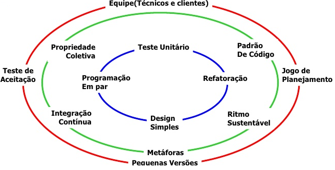

# eXtreme Programming (XP)

## 📖 Definição
eXtreme Programming (XP) é uma metodologia ágil focada na excelência técnica e na colaboração próxima entre os envolvidos no projeto. Seu objetivo é entregar software de alta qualidade por meio de práticas iterativas, feedback constante e melhoria contínua do processo.

## ☰ Características
1. **CI (Continuous Integration)** – Integração frequente do código com builds e testes automatizados, mantendo o sistema sempre funcional e evitando conflitos.  
2. **CD (Continuous Delivery)** – Entregas frequentes em **releases curtas**, garantindo valor rápido ao cliente.  
3. **CR (Continuous Refactoring)** – Refatoração contínua para manter o código limpo, sustentável e padronizado.  
4. **TDD (Test-Driven Development)** – Desenvolvimento orientado a testes para assegurar qualidade em todas as etapas.

## 🛕 Valores

| # | Valor            | Descrição |
|---|-----------------|-----------|
| 1 | **Comunicação** | Cada membro da equipe está focado em fazer as melhores escolhas para o projeto, implementar as ideias inovadoras, e apresentar com transparência as estimativas e o progresso do projeto. |
| 2 | **Simplicidade** | Foco no que deve ser realizado, não desperdiçando esforços fazendo algo desnecessário ou que não agregue valor ao produto. |
| 3 | **Feedback**    | Testes constantes e ciclos de feedback mantêm a qualidade do produto sob controle. |
| 4 | **Coragem**     | Cada membro da equipe está focado em fazer as melhores escolhas para o projeto, implementar as ideias inovadoras, e apresentar com transparência as estimativas e o progresso do projeto. |
| 5 | **Respeito**    | Cada membro da equipe é importante e valioso para o projeto, e por isso os desenvolvedores respeitam a experiência dos clientes e vice-versa. |

## 🔧 Práticas

