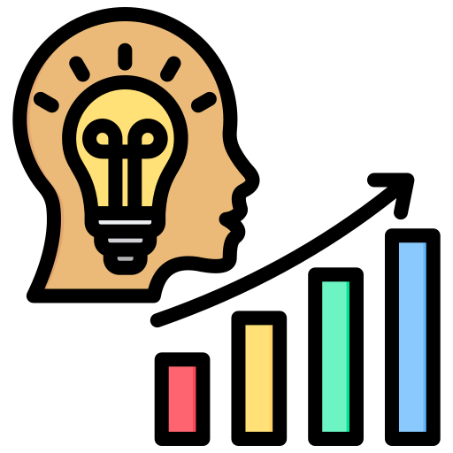
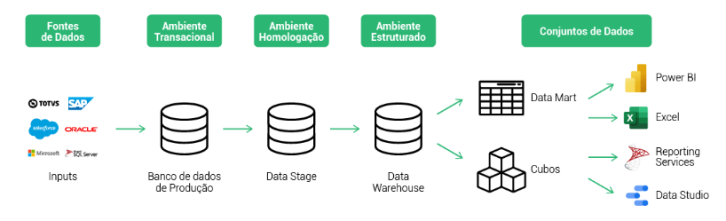
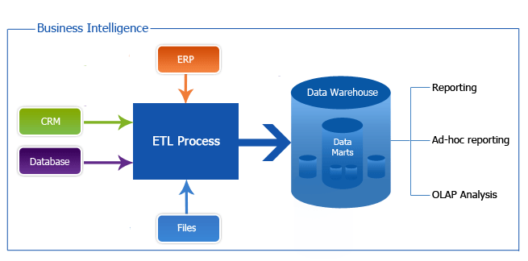
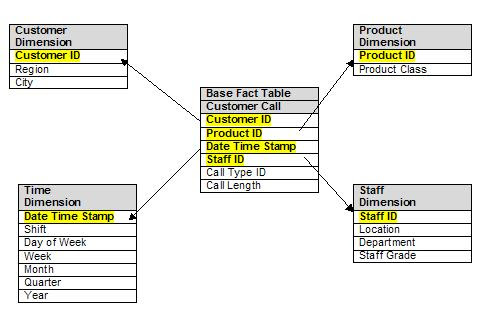
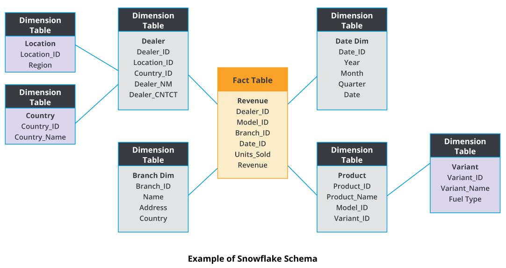
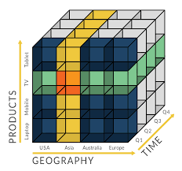

# Business Inteligence

## Panorama

## Data Warehouse
* Conjunto de dados produzidos para apoiar a **tomada de decisão** de uma organização.
* **Repositório** de dados **atuais** e **historicos** de potencial interesse para gestores de toda a organização.

### Características
* Orientado a **assuntos**:
    - Sumarização de dados
* Integrados:
    - Relacionado a **diversas fontes de dados**: sistemas transacionais, bancos de dados relacionais, documentos...
* Variante no **tempo**:
    - *Storytelling* provê insights valiosos
* Não voláteis:
    - Dados podem ser **incluidos**, mas **não modificáveis**.

## ETL - Extract, Transform, Load

* *transformar baseado nas regras de negócio*
* *carga de dados em Data Warehouse ou Data Mart*

## Data Mart
* Generalização do *Data Warehouse* com escopo limitado a um **departamento**.

## Data Lake
* Repositório de **dados brutos**:
    - Não filtrados
    - Não formatados
    - Não estruturados

## Modelo Dimensional

### Star Schema

* tabelas dimensionais **não normalizadas** implicam: 
    - maior espaço em disco (redundância de dados)
    - unicidade (não há subdimensões)
    - ligam-se apenas a Tabela de Fatos (não entre si)

### Snowflake

* tabelas dimensionais **normalizadas**:
    - maior complexidade de consultas (JOINS)
* subdimensões não se relacionam diretamente com a *fact table* 
* dimensões "adjacentes" não se relacionam

## OLAP - Online Analytics Processing

* Permite a análise e manipulação de um **grande volume** de dados através de **diferentes perspectivas**.

### Operações

* Roll-Up:
    - Agregar
    - Maior granularidade
* Drill-Down:
    - Desmembrar
    - Menor granularidade
* Drill-Across:
    - Pular um nível intermediario
* Drill-Through:
    - Mudar a dimensão de uma informação
* Pivot:
    - Rotacionar cubo
    - Transpor uma matriz
* Slice:
    - Selecionar uma dimensão
    - Filtrar
* Dice:
    - Selecionar duas ou mais dimensões
    - Selecionar um cubo
    - Filtrar um Slice