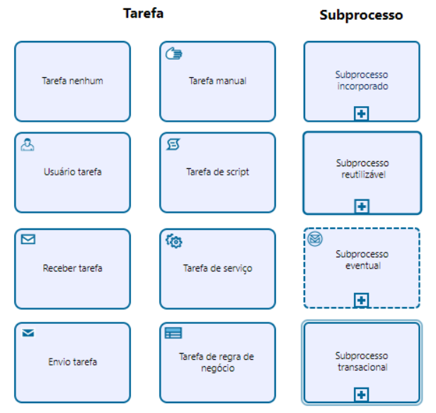

# Business Process Modeling Notation (BPMN)

## Definição

## Objetivo
> Prover recursos e elementos para modelar os processos de negócio.

> Permitir a compreensão dos processos de negócio por analistas de negócio, gerentes, técnicos, usuários e stakeholders.

## Elementos
### Objetos de Fluxo
#### Gateways
> Pontos de Ativação Incondicional

> São decisores de fluxo do processo e são representados por diamantes/losangos.

#### Eventos
> Representam a espera de que um fato aconteça para iniciar/prosseguir a execução do processo ou então sinalizar de que o processo produzirá a ocorrência de um fato durante ou ao término de sua execução.

#### Atividades
> Representam um trabalho que será executado dentro do processo, podem ser divididas em subprocessos, de caráter composto, ou tarefas, de caráter atômico (não pode ser decomposta), e são simbolizados por quadrados.

