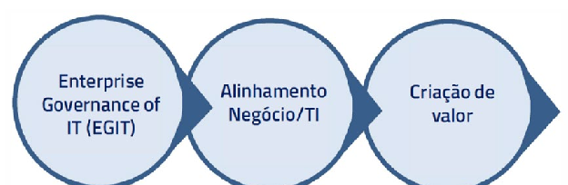
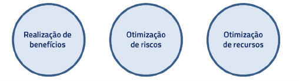
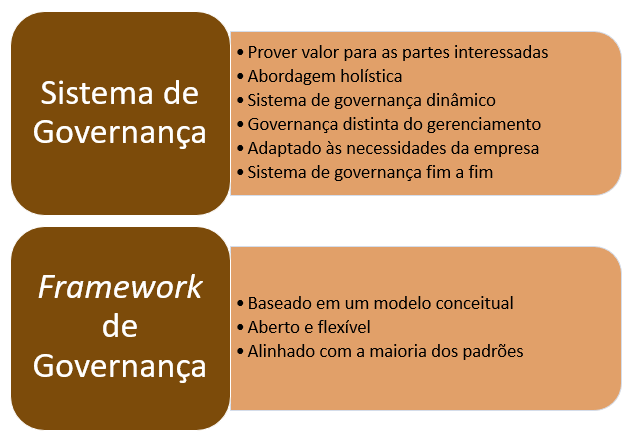
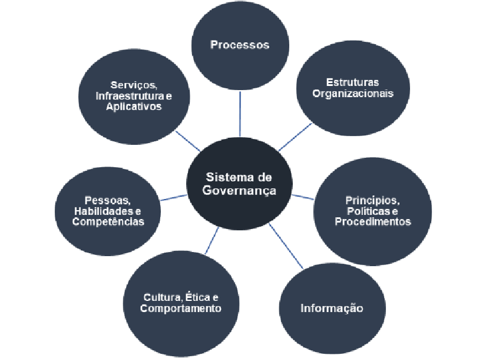
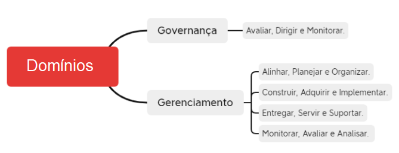
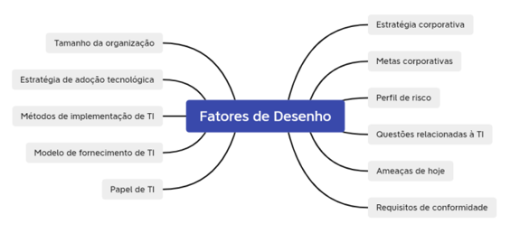
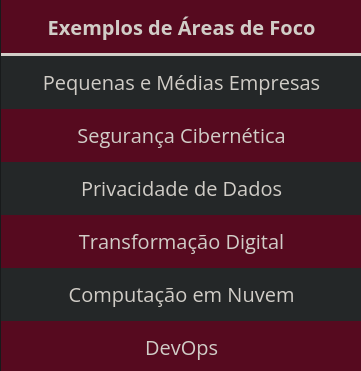

# COBIT 2019

## GCIT
> Governança Corporativa de Tecnologia da Informação

## Contexto da GCIT

## Benefícios da GCIT

## Princípios de Governança: Sistema x Framework

## Componentes do Sistema de Governança

## Domínios

### Nomenclatura dos processos:
* ADM: 
    - Palavra chave: 
        - "Garantir"
    - Ideia: "Benefícios do GCIT"
    
* CAI:
    - Palavras-chave: 
        - "Mudança"
        - "TI"
    - Ideia: "Mão na massa":
    Exemplo:
        - Definição de Requisitos
        - Gerenciar ativos
    - Disciplinas de faculdade:
    Exemplo: 
        - GC, GP

* MEA:
    - Ideia: "Leis, regulamentos"
    - Palavras-chave: 
        - "Conformidade" 
        - "Controle"
        - "Ateste"

* ESS:
    - Auto-explicativo
    - Palavras chave:
        - "Serviços"
        - "Problemas"
        - "Operações"
        - "Continuidade"

## Design Factors

## Áreas de foco:
> Descreve um certo tópico de governança, domínio ou problema que pode ser endereçado por uma coleção de objetivos de governança e de gestão e seus componentes.

