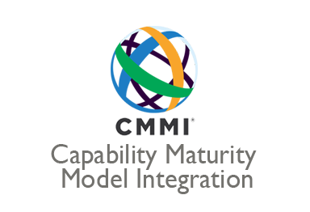

# 📘 CMMI



> Modelo de maturidade que orienta organizações na melhoria contínua de seus processos, com base em práticas mensuráveis.

---

## 📊 Níveis de Maturidade

| 🔢 Nível | 🏷️ Nome         | 📌 Características                                                           |
|---------|----------------|------------------------------------------------------------------------|
| 5       | **Otimização** 🚀 | Processos visando *inovação*, *tecnologia*, *melhoria contínua*        |
| 4       | **Gerenciado Quantitativamente** 📈 |Processos são *analisados estatisticamente* e *controlados quantitativamente*.
| 3       | **Definido** 📋   | Processos *documentados*, *padronizados*, *proativos*, *integrados à organização*               |
| 2       | **Gerenciado** ✅ |  Processos *planejados*, *executados*, *monitorados* e *controlados*              |
| 1       | **Inicial** 🔄     | Processos *adhoc*, *reativos* , *risco de atraso*, *estouro de orçamento*                    |
| 0       | **Incompleto** ⛔     | Processos *não implementado* ou *falha em atingir seu propósito*

---

## 🧭 Views (CMMI-DEV)

```{mermaid}
graph TD
  A[CMMI-DEV]
  
  %% Doing
  A --> B[Doing 🔧]
  B --> B1[ENQ: Ensuring Quality]
  B1 --> RDM[Requirements Dev. & Mgmt]
  B1 --> PQA[Process Quality Assurance]
  B1 --> VV[Verification & Validation]
  B1 --> PR[Peer Review]
  B --> B2[EDP: Eng. & Developing Products]
  B2 --> TS[Technical Solution]
  B2 --> PI[Product Integration]
  B --> B3[SMS: Selecting & Managing Suppliers]
  B3 --> SAM[Supplier Agreement Mgmt]

  %% Managing
  A --> C[Managing 📊]
  C --> PMW[Planning & Managing Work]
  PMW --> EST[Estimating]
  PMW --> PLAN[Planning]
  PMW --> MC[Monitor & Control]
  C --> MBR[Business Resilience]
  MBR --> RSK[Risk & Opportunity Mgmt]
  C --> MWF[Workforce]
  MWF --> OT[Organizational Training]

  %% Enabling
  A --> D[Enabling 🧩]
  D --> SI[Supporting Implementation]
  SI --> CAR[Causal Analysis & Resolution]
  SI --> DAR[Decision Analysis & Resolution]
  SI --> CM[Configuration Management]

  %% Improving
  A --> E[Improving 🚀]
  E --> BSC[Sustaining Capability]
  BSC --> GOV[Governance]
  BSC --> II[Implementation Infrastructure]
  E --> IMP[Improving Performance]
  IMP --> PCM[Process Management]
  IMP --> PAD[Process Asset Dev.]
  IMP --> MPM[Managing Performance & Measurement]
